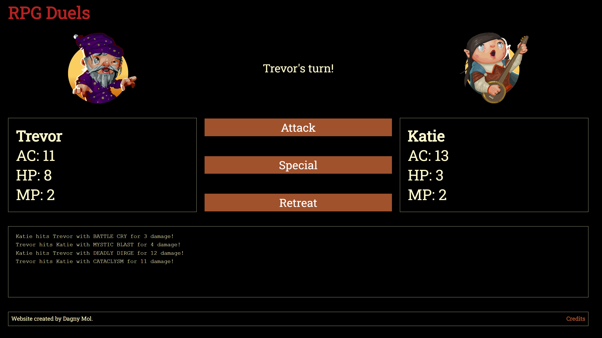

# RPG DUELS

## GAMEPLAY

RPG Duels is a basic duels game where the player can choose a character class and battle against another character of any character class.

RPG Duels implements six character classes: wizard, fighter, cleric, rogue, bard and ranger. Each class has its own strengths and weaknesses. Characters can use either regular or special attacks, which are also unique to each class.

RPG Duels has three game modes: single player skirmish, pass and play, or adventure mode.

In single player skirmish, the player character goes first, selecting a regular or special attack. The enemy automatically counterattacks. Enemy use of specials is randomly determined. All results are logged on screen.

In pass and play, control rotates between the two characters who are both controlled by the same set of inputs.

A round ends when one character reaches zero hit points. The player is offered the option to start a new round.

In adventure mode, the player character faces a series of monsters in battles similar to single player skirmish. They regain their maximum health after each fight and level up after some fights.

## TECHNOLOGY USED

RPG Duels is written with HTML, CSS and (vanilla) JavaScript.

## WHERE TO PLAY

You can play RPG Duels on GitHub Pages:

https://dagnymol81.github.io/rpg-duels/

## CREDITS

  - Character graphics by Justin Nichol from Open Game Art used under a CC-BY license: 
  https://opengameart.org/users/justin-nichol

  - Roboto Slab font by Christian Robertson from Google Fonts:
  https://fonts.google.com/specimen/Roboto+Slab
  
  ## LICENSE
  
  MIT License
